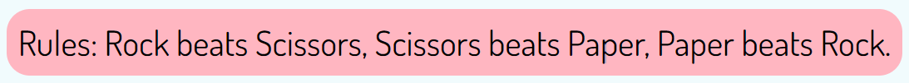

# Rock, Paper, Scissors!
"Rock, Paper, Scissors!" is a website for people who want to play the famous Rock, Paper, Scissors game against a computer.

The purpose of "Rock, Paper, Scissors!" is to be a short distraction from the daily lives of their users.
This is achieved by presenting a very easy to follow webpage with an attractive design.

Visit the deployed page here: [https://85rhrl.github.io/PP2/index.html](https://85rhrl.github.io/PP2/index.html)

## Design
A minimalistic but attractive design was chosen, there is no need for a substantial layout change based on the device where it is viewed.
- __Wireframes__
    - Wireframe was generated by hand to show the planned layout.
    
    Homepage
    

- __Colors__
    - The colors used for "Rock, Paper, Scissors!" were inspired by the 1980s with flashy colors that are easy on the eyes. The Background color of the "Ties" box is the combination of the background colors of Player and CPU and is considered an Easter Egg.

    

## Features

### Existing Features

- __Header__
    - At the top of the page the user will find the header of the page "Rock, Paper, Scissors!" next to the hand gesture for scissors, this header also works as a link to refresh the webpage if the user wants to reset the scores.

    

- __Selection Area__
    - To start playing "Rock, Paper, Scissors!" the user must chose either Rock, Paper or Scissors, this can be done by clicking/tapping either of the options which are presented as images of the Rock, Paper or Scissors hand gestures respectively.
    - Under every option there is a text describing the hand gesture for those who haven't played the game.

    

- __Results Area__
    - The Results Area is located under the Selection Area and displays the option chosen by the user and CPU.
    - At the game start the Results Area displays a placeholder image showing the 3 possible options and all scores sets to zero.

    

    - As the game progresses the Results Area displays the latest option chosen by the user and CPU, their respectives scores, the number of Ties and the result of the latest game.

    

- __Reset Scores__
    - Under the Results area a Reset Scores button is displayed. When clicked/tapped all scores are reset to zero.

    

- __Rules__
    - The rules of the game are presented under the Results area.

    

- __Footer__
    - At the bottom of the page the user finds a simple footer with a link to the GitHub page where it can see the source code of the "Rock, Paper, Scissors!" game.

    

### Features Left to Implement

- __Implement a 5 rounds game mode__
    - Create a game mode where 5 games are played and who has the most wins, wins.

- __Add game sounds__
    - Play different sounds depending if the user wins, ties or loses.

## Testing

Several test were carried out, please refer to [TESTING.md](TESTING.md) for more information.

## Deployment

GitHub pages was used to deploy the project by following the steps described below:
    
1. Go to the [github.com/85rhrl/PP2](https://github.com/85rhrl/PP2) repository.
2. Click on the Setting tab on the top. ([github.com/85rhrl/PP2/settings](https://github.com/85rhrl/PP2/settings))
3. Click the Pages link on the left hand side menu. ([github.com/85rhrl/PP2/settings/pages](https://github.com/85rhrl/PP2/settings/pages))
4. Select "Deploy from a branch" from the Source dropdown menu.
5. Select "main" branch and press the "Save" button on the right.
6. After some time the project will be deployed.

The deployed project can be viewed here: [https://85rhrl.github.io/PP2/index.html](https://85rhrl.github.io/PP2/index.html)

## Credits

### Code
The code used for the favicon is based from the Love Running walkthrough project.

The JavaScript code is based on the Portfolio Project Scope (ULTIMATE Rock Paper Scissors) video from Code Institute.

The code for setting the background color of the Ties h3 element and Rules p element is based from a question posted on [Stackoverflow](https://stackoverflow.com/questions/14310154/how-do-i-set-a-background-color-for-the-width-of-text-not-the-width-of-the-enti).

### Content
The Victory hand (Scissors) emoji for the favicon was downloaded from [favicon.io](https://favicon.io/emoji-favicons/victory-hand) which in turn comes from the open source project Twemoji. The graphics are copyright 2020 Twitter, Inc and other contributors. The graphics are licensed under CC-BY 4.0.

The Rock, Paper, Scissors hand gestures were downloaded from [flaticon.com](https://www.flaticon.com/free-icon/rock-paper-scissors_6727646)

The GitHub icon used for the footer link was taken from [fontawesome.com](https://fontawesome.com/icons/square-github?f=brands&s=solid)

The Dosis font was downloaded from [Google Fonts](https://fonts.google.com/specimen/Dosis)

The image of the Rock, Paper, Scissors! webpage across several devices used on the README introduction was generated using [UI.dev](https://ui.dev/amiresponsive)

### Acknowledgements

I would like to express my gratitude to the following people:

- Jubril Akolade for mentoring me, giving me guidance and encouragement.
- Kay Welfare for their continuous help and encouragement.
- My fellow classmates for their support and feedback.